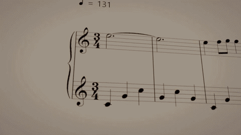

# HyperFrames Score Animation

一个用于制作真实曲谱驱动的 HyperFrames 3D 音乐动画 Skill。

This repository contains a reusable Codex Skill for building deterministic HyperFrames 3D score animations from real MusicXML/MXL, MIDI, and audio.

## Output Example / 输出示例

15 秒示例来自真实曲谱动画成片，包含同步音频：



- [Download the 15-second MP4 example](examples/hyperframes-score-animation-15s.mp4)
- [Download the GIF preview](examples/hyperframes-score-animation-15s.gif)

示例内容包括真实五线谱、谱面上的多球分裂与汇聚、连续镜头、发光球、短拖尾和暗调纸面舞台。

### Additional Case / 新案例

来自 `小球+workbuddy.mp4` 的 15 秒高分辨率片段：

- [Download the Workbuddy 15-second MP4 case](examples/hyperframes-score-animation-workbuddy-15s.mp4)
- Source / 源视频: 2560x1440, 30 fps, H.264 + AAC
- Clip length / 片段时长: 15 seconds

This case is included as a visual reference for the score-following camera, luminous balls, multi-ball behavior, trails, and dark paper-stage treatment.

这个案例用于展示曲谱跟随镜头、发光小球、多球表现、拖尾光效和暗调纸面舞台。

## What This Skill Does / Skill 作用

### 中文

这个 Skill 适用于：

- 用真实 `.mxl`、`.musicxml` 或 `.xml` 渲染曲谱；
- 用 MIDI 控制音符时间、音高、时值、和弦和声部；
- 将 `MIDI Note -> MusicXML Note -> SVG Notehead` 建立成可审计映射；
- 在 Three.js WebGPU/WebGL 或 TypeGPU 中制作确定性的 3D 演奏动画；
- 处理单音、多音、和弦、重复音、延音和 Tie；
- 让镜头沿曲谱连续滑行，而不是按系统换行跳转；
- 在导出前检查瞬移、回跳、错音、漏音、黑帧和音画同步。

它不是普通的音频可视化模板，也不使用均匀生成的假音符位置。

### English

Use this Skill when you need to:

- render a real score from `.mxl`, `.musicxml`, or `.xml`;
- use MIDI for onset timing, pitch, duration, chords, and voices;
- audit the mapping from `MIDI Note -> MusicXML Note -> SVG Notehead`;
- build deterministic 3D performance animation with Three.js WebGPU/WebGL or TypeGPU;
- handle single notes, chords, repeated notes, sustain, and ties;
- follow the score with one continuous camera move;
- audit teleporting, backward motion, wrong landings, missing events, black frames, and sync.

This is not a generic audio visualizer and must not invent note positions with a uniform spacing rule.

## Install / 安装

Skill 目录通常位于：

```text
C:\Users\WIN10\.codex\skills\hyperframes-score-animation
```

显式调用：

```text
$hyperframes-score-animation
```

验证 Skill 结构：

```powershell
python C:\Users\WIN10\.codex\skills\.system\skill-creator\scripts\quick_validate.py `
  C:\Users\WIN10\.codex\skills\hyperframes-score-animation
```

## Tutorial / 教学

### 1. Prepare a HyperFrames project / 准备项目

建议使用一个已有的 HyperFrames 项目，保留已经验证过的依赖版本：

```text
project/
  assets/
    score.mxl
    performance.wav
    performance.mid
  src/
    scene.js
    ball-motion.js
  scripts/
    build-score-data.mjs
    audit-motion.mjs
  package.json
```

Required runtime pieces:

- HyperFrames CLI, pinned in `package.json`;
- Three.js `WebGPURenderer` with WebGL fallback;
- Verovio or OpenSheetMusicDisplay;
- a MIDI parser such as `@tonejs/midi`;
- FFmpeg and FFprobe.

不要在已经存在可运行项目时重复初始化另一个项目。  
Do not initialize a second project when a working project already exists.

### 2. Build score data / 生成曲谱数据

预处理脚本应该只运行一次或在素材变化时运行，输出冻结的数据文件：

```text
duration
fps
audioSync
score.pages or scoreSystems
notes[]
events[]
tieEdges[]
cameraReadPoints[]
stats
```

每个音符至少保留：

```text
id
renderId
midiNote
pitch
staff
voice
measureIndex
startTime
duration
x
y
pageIndex
systemIndex
```

MusicXML/MXL controls visual structure. MIDI controls timing.  
MusicXML/MXL 决定视觉结构，MIDI 决定时间轴。

### 3. Extract real notehead positions / 提取真实符头坐标

正确流程：

1. 解压 MXL；
2. 读取 `META-INF/container.xml`；
3. 解析真正的 MusicXML；
4. 用 Verovio 渲染 SVG；
5. 定位 `<g class="note">`；
6. 定位 notehead 或其 `<use>` 元素；
7. 累积父级 SVG transform；
8. 转成 Three.js 世界坐标。

Never use:

```js
x = noteIndex * constant;
```

The target should be the actual notehead, not the whole note-group bounding box.

### 4. Map MIDI events / 建立 MIDI 映射

推荐以起音组为单位匹配：

- 按小时间隔分组同时触发的 MIDI 音符；
- 按声部、谱表和音高集合建立 MusicXML 起音组；
- 校验音高 multiset、声部、时值和顺序；
- 对重复同音和重复和弦单独审计；
- 在开头、中段、结尾抽样检查映射。

如果只有简单的同音高队列，但没有验证声部和顺序，不要接受映射结果。  
If repeated pitches or voices make the mapping ambiguous, fail closed and diagnose it instead of silently guessing.

### 5. Align audio / 校验音频同步

不要直接相信 MusicXML 里打印的 BPM。实际动画时间应来自 MIDI 的秒时间轴。

用音频起音和 MIDI 起音比较：

- 开头锚点；
- 中段锚点；
- 后段锚点；
- 尾音。

判断方式：

```text
固定误差       -> 施加一个 audio offset
误差持续增加   -> 存在 tempo drift
无法稳定检测   -> 更换或重新生成音轨
```

如果真人演奏在前半段同步、后半段漂移，不要用一个固定 Offset 强行修复；优先使用 MIDI 同步的钢琴音轨。

### 6. Build multi-ball motion / 构建多球运动

每个谱表使用固定数量的球槽位，数量等于该谱表最大视觉和弦数量。

相邻事件之间：

1. 计算源事件落点；
2. 计算目标事件落点；
3. 用最小代价匹配保持球的身份；
4. 保留配对球槽位；
5. 新音符获得空闲槽位；
6. 多球到单音时让多余球在同一时间段汇聚或淡出。

运动必须使用整个时间间隔：

```js
progress = clamp((time - startTime) / (endTime - startTime), 0, 1);
position = lerp(start, end, progress);
position.z += Math.sin(progress * Math.PI) * jumpHeight;
```

不要等到最后 20% 再追赶，也不要在事件边界把球重置到第一个音符。

### 7. Handle ties and continuation / 处理延音和延长音

Note On、Tie、Sustain 和 Release 必须是不同数据类型：

- Note On 触发一次新的落点和圆环；
- Tie 不得误触发新的起音；
- 如果视觉设计要求延长音继续跳，必须从 Tie endpoint 或 release cue 生成明确的 continuation cue；
- 同一坐标重复起音仍然需要独立跳跃。

### 8. Build a continuous camera / 构建连续跟随镜头

镜头沿预计算的单调阅读路径滑动：

- 不在换行处跳切；
- 不直接使用 `camera.x = ball.x`；
- 使用 look-ahead、damping 和 inertia；
- 让当前上下谱表与前方一小段谱面保持可读；
- 让纸面舞台覆盖整个镜头范围，避免出现黑色空白区域。

### 9. Render and audit / 渲染与审计

HyperFrames 场景必须响应 `hf-seek`：

```js
window.addEventListener("hf-seek", (event) => {
  const time = Number(event.detail?.time) || 0;
  const work = renderAt(time);
  event.detail?.waitUntil?.(work);
});
```

在正式导出前检查：

- 全曲映射数量；
- 最大单帧运动距离；
- 回跳帧；
- 边界位置断点；
- 球槽位连续性；
- 和弦分裂与汇聚；
- 延音和 Tie；
- 黑帧与未覆盖纸面；
- FFprobe 的分辨率、帧率、时长和音频流。

## Recommended Commands / 推荐命令

```powershell
npm install
npm run build
npm run check
npm run audit:motion
npm run render
npm run render:4k
```

Typical 4K command:

```powershell
npx hyperframes@0.8.76 render `
  --quality delivery `
  --fps 60 `
  --resolution landscape-4k `
  --crf 10 `
  --workers 2 `
  --output out/final-4k-60fps.mp4
```

## Troubleshooting / 常见坑

| Problem / 问题 | Correct response / 正确处理 |
| --- | --- |
| MusicXML BPM 与音频时长不一致 | 以 MIDI 秒时间轴和音频起音锚点为准，不照抄打印 BPM |
| 球最后一小段突然赶路 | 使用两个起音之间的完整时间区间插值 |
| 和弦后多余球漂浮 | 使用稳定 ball slots，并在目标单音期间汇聚或淡出 |
| 球回到第一个音符 | 不要每帧重建事件索引；使用单调的 latest-event 查找 |
| 延音被当成新的 Note On | 分离 Note On、Tie、Sustain 和 continuation cue |
| 画面出现黑色空白 | 扩大纸面舞台和纹理覆盖范围，检查相机 frustum |
| 4K 只是放大 720p | 设置受控 `devicePixelRatio`，再使用 4K capture preset |
| HyperFrames `sweep_static` 报错 | 用 seek 抽帧和最终 MP4 验证真实运动，不能加入无意义 DOM 动画 |

## Repository Layout / 仓库结构

```text
SKILL.md
agents/
  openai.yaml
references/
  4k-rendering.md
  mapping-and-timing.md
  motion-model.md
  pipeline.md
  validation-checklist.md
  visual-runtime.md
examples/
  hyperframes-score-animation-15s.mp4
  hyperframes-score-animation-15s.gif
  hyperframes-score-animation-workbuddy-15s.mp4
README.md
```

## License and Use

This repository is a reusable workflow template. Replace the example score, MIDI, audio, and visual style with your own project assets while keeping the deterministic timing and validation rules.
