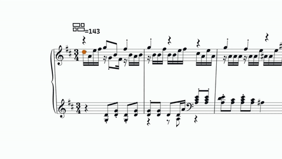

# HyperFrames Score Animation

一个用于制作真实曲谱驱动的 HyperFrames 3D 音乐动画 Skill。

This repository contains a reusable Codex Skill for building deterministic HyperFrames 3D score animations from real MusicXML/MXL, MIDI, and audio.

## Output Example / 输出示例

15 秒示例来自真实曲谱动画成片，包含同步音频：

- [Download the 15-second MP4 example](examples/hyperframes-score-animation-15s.mp4)
- [Download the GIF preview](examples/hyperframes-score-animation-15s.gif)

示例内容包括真实五线谱、谱面上的多球分裂与汇聚、连续镜头、发光球、短拖尾和暗调纸面舞台。

### Additional Case / 新案例

来自 `小球+workbuddy.mp4` 的 15 秒高分辨率片段：

- [Download the Workbuddy 15-second MP4 case](examples/hyperframes-score-animation-workbuddy-15s.mp4)
